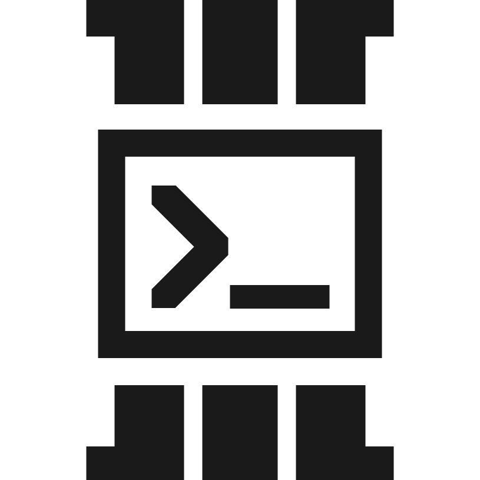
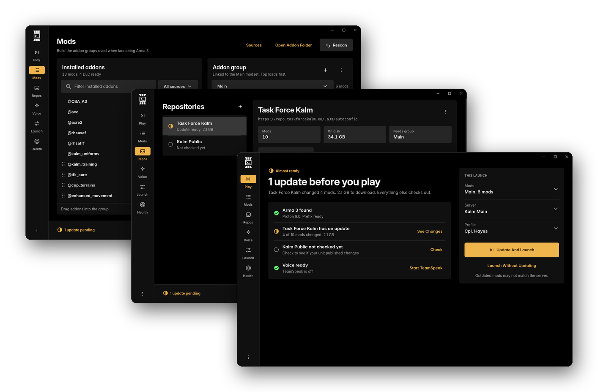

<div align="center">

<picture>
  <source media="(prefers-color-scheme: dark)" srcset="docs/logo/logo-white.svg">
  
</picture>

# Armasync

**Still booting Windows because your unit runs Arma3Sync? You don't have to.**

[](https://github.com/Pekururu/Armasync-Linux/releases/latest)
[](https://aur.archlinux.org/packages/armasync-bin)
[](LICENSE)

[Install](#install) · [Getting started](#getting-started) · [Game day](#game-day) · [When something goes wrong](#when-something-goes-wrong) · [Known limitations](#known-limitations)

</div>

Armasync reads your unit's Arma3Sync repository, over FTP or HTTP(S), downloads
the mods and keeps them up to date. It sets up TeamSpeak radio (ACRE2 or TFAR)
inside Proton and starts Arma through Steam with your mods in the right order.
Your unit keeps its repository. You keep Linux.

<p align="center">
  
</p>

## Install

**Arch Linux**, and CachyOS, EndeavourOS or Manjaro:

```sh
yay -S armasync-bin
```

**Everything else:** download your file from the
[latest release](https://github.com/Pekururu/Armasync-Linux/releases/latest).

| Distribution | File | Then |
| --- | --- | --- |
| Debian, Ubuntu | `.deb` | `sudo apt install ./Armasync_*_amd64.deb` |
| Fedora | `.rpm` | `sudo dnf install ./Armasync-*.x86_64.rpm` |
| Anything else | `.AppImage` | `chmod +x` it and run it |

## What you need

The packages install the interface libraries (WebKitGTK 4.1, GTK 3) for you.
Install the rest from your distribution.

| For | You need |
| --- | --- |
| Playing | **Steam** with **Arma 3**, and a **Proton** version turned on for it (Steam → Arma 3 → Properties → Compatibility) |
| TeamSpeak radio *(optional)* | **protontricks**, from your distribution or `pipx install protontricks`. The Flatpak isn't enough: Armasync needs `protontricks-launch` on `PATH` too.<br>**PipeWire** with **WirePlumber** and **pipewire-pulse**. Current Fedora, Ubuntu and Arch installs have these already. |
| Restore points and support bundles *(optional)* | **tar** and **zstd**. Nearly every distribution has these already. |

Armasync checks for all of this. The Health screen shows what's missing and
how to install it.

## Getting started

Do this once. It takes about ten minutes, plus the time your unit's mods take
to download.

> [!IMPORTANT]
> Run Arma 3 once from Steam first, and quit at the main menu. That makes Proton
> create the folder Armasync works in.

1. **Add your mod folders.** Open **Mods**, then **Sources**, and press
   **Add Folder** for each folder that holds `@mod` folders. Add
   **Steam Workshop** from the same list if you use it. Armasync only reads
   these folders. Removing one never deletes files.
2. **Add your unit's repository.** Ask your unit for their autoconfig link.
   It's the same one Arma3Sync uses and ends in `/.a3s/autoconfig`. Open
   **Repos**, press **+** and paste it. Armasync checks the link before saving
   and shows what you're adding. Pick a download folder and press
   **Add And Download**.
3. **Make an addon group.** An addon group is the list of mods Arma starts
   with, in load order. If your unit publishes modsets, pick one on the
   repository and press **Create Addon Group**. Otherwise build one in **Mods**
   by dragging addons from the left into the group on the right, or press
   Enter on one. Alt+↑ and Alt+↓ change the load order from the keyboard.
4. **Set up voice.** Open **Voice** and follow the checklist. Each step says
   what it does and has one button. When TeamSpeak's installer opens, choose
   **Install for all users** and keep the default folder.
5. **Add your profile and server.** In **Launch**, add the player name you use
   and your unit's server. The server password is stored on this computer only.

## Game day

Open Armasync. **Play** shows whether you're ready and what's in the way, each
with a button to fix it.

1. Open **Repos** and press **Check Now** on your repository. If your unit
   changed mods, Play says so.
2. Start TeamSpeak from Play or Voice and join your unit's TeamSpeak server.
3. Check the addon group, server and profile, then press **Launch**. If there's
   an update, press **Update And Launch** to download it first.

The game's own launcher is skipped. Armasync starts Arma through Proton with
your mods in the order of the group.

## The screens

| Screen | What it's for |
| --- | --- |
| **Play** | Whether you're ready, and the Launch button |
| **Mods** | Your installed addons and the groups you launch with |
| **Repos** | Your unit's repositories: check, see what changed, sync |
| **Voice** | TeamSpeak and radio setup, one step at a time |
| **Launch** | Startup options, profiles, servers and the launch command |
| **Health** | Checks, folders, logs and repairs |

Every screen except Play has the launch dock at the bottom: what you'll launch
with, and **Launch**. Settings save automatically.

## When something goes wrong

Open **Health**. Problems come first, each with what's wrong and how to fix it.
Passed checks fold away.

<details>
<summary><b>Mods are missing in game</b></summary>

Check the addon group in the dock. Then open **Repos** and press
**Check Again**. Anything missing shows under What changed.

</details>

<details>
<summary><b>No radio in TeamSpeak</b></summary>

Start TeamSpeak from Armasync, not from your desktop. Then make sure the radio
plugin is on under Tools → Options → Addons.

</details>

<details>
<summary><b>ACRE reports a missing MFC or VC140 runtime</b></summary>

Only then, use **ACRE MFC/VC140 repair** in Health. It makes a restore point
first.

</details>

> [!TIP]
> Asking for help? Press **Support Bundle** in Health. It saves the checks,
> recent logs, the newest Arma log and your launch settings to your Downloads
> folder in one file. Server passwords are blanked out, and repository logins
> and your TeamSpeak identity aren't included.

## Known limitations

These are being worked on for v0.6.0.

- **Compressed repositories don't sync yet.** If your unit builds its
  repository with Arma3Sync's compression option, the sync stops with
  "compressed repository entry is not supported yet". Checking still works.
- **Changed files download whole over FTP.** On HTTPS repositories Armasync
  downloads only the parts of a file that changed, like Arma3Sync. FTP
  repositories don't support that, so a changed file downloads again in full.
- **Updates aren't checked on their own.** Nothing checks in the background.
  Open **Repos** and press **Check Now** to see whether your unit changed mods.
- **Armasync doesn't know when Arma is running.** Launch works a second time,
  and a sync can start while the game has the mods open. Close Arma before you
  sync.

## Planned

- **Swifty repositories.** A second reader for Swifty's `repo.json`/`.srf`
  format, reusing the same check and download engine. Arma3Sync repositories
  are fully supported today.

## Development

Building from source or contributing? See
[`docs/DEVELOPMENT.md`](docs/DEVELOPMENT.md).
